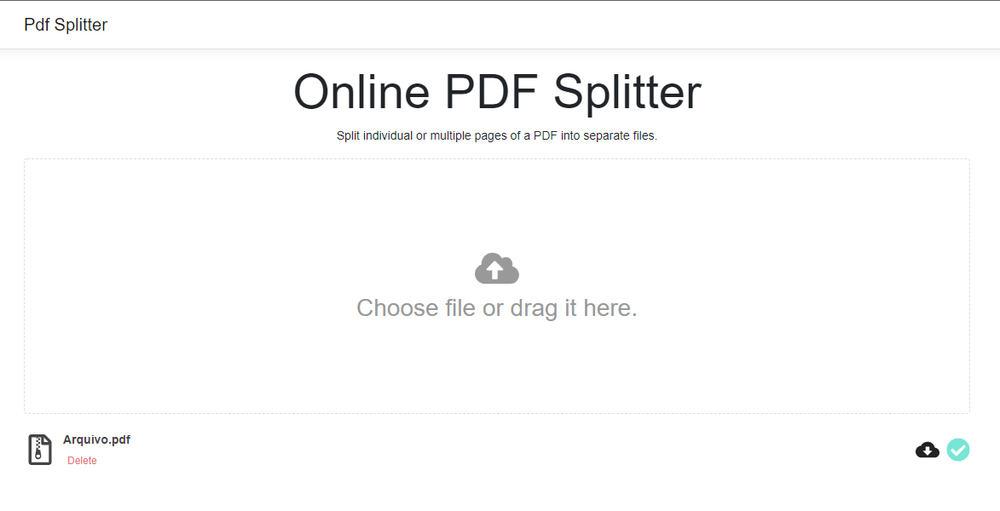

<h1 align="center">
   PDF Splitter
</h1>
 
 
    
 

<h3 align="center">  
  <a href="#information_source-sobre">Sobre</a> |
  <a href="#rocket-tecnologias">Tecnologias</a> |  
  <a href="#gear-ferramentas">Ferramentas</a> |
  <a href="#licença">Licença</a> 
</h3>

## :information_source: Sobre

Projeto de um separador de PDF em React e .Net. Converte cada página do PDF um arquivo.  
PDF Splitter project built with React and .Net. 

## :rocket: Tecnologias

HTML 
CSS 
JavaScript 
C#

## :gear: Ferramentas

- React 
- .Net Core
- Gembox

## Licença
Esse projeto está sob a licença MIT.
